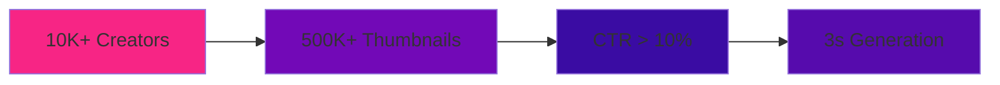
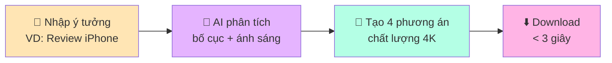
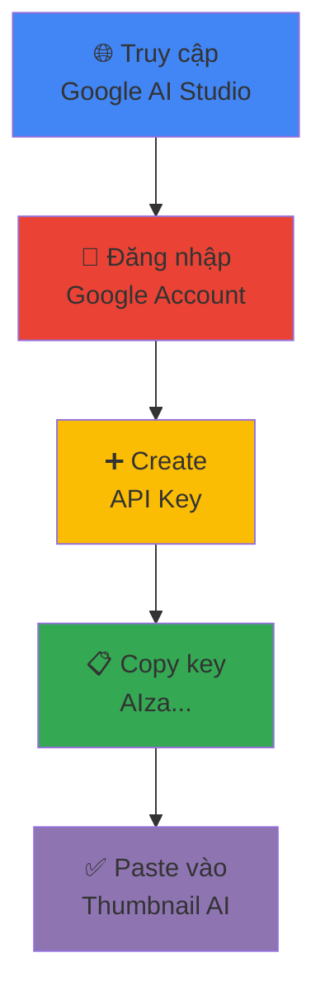

<div align="center">


[](https://aistudio.google.com/)
[](https://reactjs.org/)
[](https://www.typescriptlang.org/)
[](LICENSE)

[](https://github.com/your-username/thumbnail-ai/stargazers)
[](https://github.com/your-username/thumbnail-ai/network/members)
[](https://github.com/your-username/thumbnail-ai/issues)

<p align="center">
  <a href="#-tại-sao-chọn-thumbnail-ai-studio">Tính năng</a> •
  <a href="#-cài-đặt-nhanh">Cài đặt</a> •
  <a href="#-sử-dụng">Hướng dẫn</a> •
  <a href="#-style-gallery">Style Gallery</a> •
  <a href="#-roadmap-2025">Roadmap</a> •
  <a href="#-đóng-góp">Contribute</a>
</p>

</div>

---

## 🎯 **Tại Sao Chọn Thumbnail AI Studio?**

<div align="center">

> **"Thumbnail không chỉ là ảnh. Nó là lời hứa với người xem."**

| 🚀 **SIÊU NHANH** | 🧬 **DIGITAL TWIN** | 🤖 **AI GEMINI 1.5** | 🆓 **MIỄN PHÍ** |
|:---:|:---:|:---:|:---:|
| **< 3 giây**<br/>Tạo 4 phương án 4K | **Face-Lock Tech**<br/>Upload 1 ảnh selfie | **Google Gemini**<br/>Vision + Typography | **Forever Free**<br/>No watermark |
|  |  |  |  |

</div>

### 📊 **Thống kê ấn tượng**

<div align="center">



**Thumbnail AI Studio** giải quyết bài toán "Cạn ý tưởng" của Creator. Bằng cách kết hợp **Gemini Vision 1.5** và **Digital Twin Protocol**, chúng tôi giúp bạn tạo ra các thiết kế đạt chuẩn CTR > 10% chỉ trong 3 giây.

</div>

---

## 🚀 **Cài Đặt Nhanh**

### 🌐 **Web App** *(Khuyến nghị)*

<div align="center">

[](https://thumbnail-ai.vercel.app)

```bash
🔗 Browser → 🔍 "Thumbnail AI Studio" → 🎨 Start Creating → ✅ Done!
```

</div>

### 👨‍💻 **Local Development** *(For Developers)*

<details>
<summary><b>📦 Cài đặt từ Source Code</b></summary>

```bash
# 1. Clone repository
git clone https://github.com/your-username/thumbnail-ai.git
cd thumbnail-ai

# 2. Install dependencies
npm install

# 3. Setup environment
cp .env.example .env
# Điền GEMINI_API_KEY vào file .env

# 4. Start development server
npm run dev

# 5. Build for production
npm run build
```

</details>

---

## 🎮 **Sử Dụng**

### ⚡ **Quick Start - Chỉ 3 bước!**

<div align="center">



</div>

### 🎬 **Workflow chi tiết**

<div align="center">

| Bước | Mô tả | Thời gian |
|:---:|:---|:---:|
| **1️⃣** | **Input:** Gõ ý tưởng thô (VD: "Review iPhone 15 phong cách Batman") | 10s |
| **2️⃣** | **AI Processing:** Gemini phân tích bố cục, ánh sáng, typography | 2s |
| **3️⃣** | **Output:** Nhận 4 phương án Thumbnail 4K chất lượng cao | 1s |
| **4️⃣** | **Download:** Chọn và tải về phương án yêu thích | Instant |

</div>

---

## 💎 **Tính Năng Cốt Lõi**

### 🔥 **Chúng tôi tập trung vào những gì Creator cần nhất: Tốc độ & Chính xác**

<details open>
<summary><b>🧬 Digital Twin Technology (Face-Lock)</b></summary>

**Công nghệ độc quyền Made in Vietnam**

```yaml
✨ Tính năng:
  - Upload 1 ảnh selfie
  - AI đưa khuôn mặt vào mọi ngữ cảnh
  - Không bị biến dạng (Uncanny Valley)
  - Phù hợp: Doanh nhân, Gaming, Vlog, Review

🎯 Ưu điểm:
  - Nhất quán thương hiệu cá nhân
  - Tiết kiệm 90% thời gian chụp ảnh
  - Tự nhiên như ảnh thật
```

</details>

<details>
<summary><b>✍️ Vietnamese Typography Master</b></summary>

**Tự hào 100% Việt hóa**

```yaml
🇻🇳 Đặc biệt:
  - Model fine-tune riêng cho Tiếng Việt
  - Xử lý dấu phức tạp (á, à, ả, ã, ạ)
  - Font Bold Sans-serif chuẩn Mobile
  - Tối ưu cho mắt đọc lướt

📐 Layout:
  - Text không che mặt nhân vật
  - Tự động áp dụng quy tắc 1/3
  - Tam giác vàng tối ưu CTR
```

</details>

<details>
<summary><b>🧠 Magic Prompt Engine</b></summary>

**Bí từ? Không sao cả!**

```yaml
📝 Input đơn giản:    "Mèo ăn cá"

🤖 AI viết lại thành:
  "Cinematic shot of British Shorthair cat eating fish,
   rim lighting, bokeh background, 8K resolution,
   dramatic atmosphere, professional photography"

✅ Tự động optimize:
  - Lighting setup
  - Camera angle
  - Color grading
  - Mood & atmosphere
```

</details>

<details>
<summary><b>🎨 Smart Layout Grid</b></summary>

**Bố cục hoàn hảo mọi lúc**

```yaml
📏 Tự động áp dụng:
  - Quy tắc 1/3 (Rule of thirds)
  - Tam giác vàng (Golden triangle)
  - Leading lines
  - Negative space

🎯 Đảm bảo:
  - Text rõ ràng, dễ đọc
  - Không che khuôn mặt
  - Cân bằng màu sắc
  - CTR tối ưu
```

</details>

---

## 🎨 **Style Gallery**

### **Kho thư viện prompt xu hướng YouTube 2024**

<div align="center">

| 😲 **MrBeast Viral** | 🎬 **3D Disney/Pixar** | 🎮 **Neon Cyberpunk** |
|:---:|:---:|:---:|
|  |  |  |
| **Đặc điểm:**<br/>• Độ bão hòa cao<br/>• Biểu cảm lố<br/>• Màu tương phản | **Đặc điểm:**<br/>• Ánh sáng mềm<br/>• Texture chi tiết<br/>• Phong cách hoạt hình | **Đặc điểm:**<br/>• Màu LED rực rỡ<br/>• Tương lai<br/>• Gaming aesthetic |

</div>

<div align="center">

| 🔥 **Viral Thumbnail** | 💼 **Professional** | 🎭 **Cinematic** |
|:---:|:---:|:---:|
|  |  |  |
| **Phù hợp:**<br/>Entertainment, Challenge, Prank | **Phù hợp:**<br/>Tutorial, Review, Education | **Phù hợp:**<br/>Storytelling, Documentary, Music |

</div>

---

## 🛠️ **Tech Stack**

### **Kiến trúc Monorepo hiện đại, tối ưu cho Scalability**

<div align="center">

| Domain | Technologies |
|:---|:---|
| **🤖 Core AI** |   |
| **⚛️ Frontend** |    |
| **🎨 Styling** |   |
| **☁️ Deployment** |   |
| **🔧 Tools** |   |

</div>

---

## 🔑 **Hướng Dẫn Lấy API Key**

### **Google Gemini API (Miễn phí)**

<div align="center">



</div>

**Chi tiết từng bước:**

1. **Truy cập:** [Google AI Studio](https://aistudio.google.com/app/apikey)
2. **Đăng nhập:** Sử dụng tài khoản Google của bạn
3. **Tạo key:** Nhấn nút xanh **"Create API Key"**
4. **Copy:** Sao chép chuỗi bắt đầu bằng `AIza...`
5. **Paste:** Dán vào ứng dụng Thumbnail AI Studio

<div align="center">

> **🔒 Privacy First:** API Key của bạn chỉ được lưu cục bộ trên trình duyệt (`LocalStorage`) và gửi trực tiếp đến server của Google. **Không qua trung gian.**

[](https://aistudio.google.com/app/apikey)

</div>

---

## 📂 **Cấu Trúc Thư Mục**

<details>
<summary><b>📁 Directory Structure</b></summary>

```text
thumbnail-ai/
├── 📂 public/              # Static assets
│   ├── favicon.ico
│   └── images/
├── 📂 src/
│   ├── 📄 App.tsx          # Main Entry point
│   ├── 📂 components/      # Reusable UI components
│   │   ├── HistoryGallery.tsx
│   │   ├── ImageUploader.tsx
│   │   └── ThumbnailForm.tsx
│   ├── 📄 constants.ts     # App constants & config
│   ├── 📄 index.html       # HTML entry point
│   ├── 📄 index.tsx        # React entry point
│   ├── 📄 metadata.json    # App metadata
│   ├── 📂 services/        # API integrations
│   │   └── geminiService.ts
│   └── 📄 types.ts         # TypeScript definitions
├── 📄 .env.example         # Environment variables template
├── 📄 .gitignore
├── 📄 package.json
├── 📄 tailwind.config.js   # Tailwind configuration
├── 📄 tsconfig.json        # TypeScript config
├── 📄 vite.config.ts       # Vite config
└── 📄 README.md            # You are here!
```

</details>

---

## 🛡️ **Bảo Mật & Quyền Riêng Tư**

<div align="center">


| 🔐 **LOCAL STORAGE** | 🚫 **NO DATABASE** | 🚫 **NO TRACKING** | ✅ **OPEN SOURCE** |
|:---:|:---:|:---:|:---:|
| Browser Only | Zero Upload | No Analytics | Full Transparency |
| Lưu trên máy bạn | Không lưu server | Không theo dõi | Mã nguồn công khai |

**🔐 Cam kết bảo mật:**
- ✅ API Key KHÔNG được gửi đến server của chúng tôi
- ✅ Dữ liệu CHỈ lưu trên trình duyệt (LocalStorage)
- ✅ KHÔNG thu thập thông tin cá nhân
- ✅ KHÔNG có backdoor hay malware
- ✅ Code được review bởi cộng đồng

</div>

---

## 🌟 **Compatibility & Performance**

### ✅ **Trình duyệt được hỗ trợ**

<div align="center">

| Browser | Version | Performance | Score |
|:---|:---|:---:|:---:|
|  | Latest | ⚡⚡⚡⚡⚡ |  |
|  | Latest | ⚡⚡⚡⚡⚡ |  |
|  | Latest | ⚡⚡⚡⚡ |  |
|  | Latest | ⚡⚡⚡⚡ |  |

**Overall Performance:** 

</div>

---

## 🚀 **Roadmap 2025**

### 📅 **Version 2.0** *(Q1 2025)*


- 🎭 **Face Swap Pro** - Công nghệ Digital Twin nâng cao
- 🌈 **Color Palette AI** - Gợi ý màu sắc theo xu hướng
- 📱 **Mobile App** - iOS & Android native
- 🎬 **Video Thumbnail** - Hỗ trợ video preview
- 💾 **Cloud Sync** - Đồng bộ dự án qua thiết bị

### 🚀 **Version 2.5** *(Q2 2025)*


- 🤝 **Team Collaboration** - Làm việc nhóm real-time
- 📊 **Analytics Dashboard** - Theo dõi CTR thực tế
- 🎨 **Brand Kit** - Quản lý màu sắc, font chữ thương hiệu
- 🔌 **API Integration** - Tích hợp với các nền tảng khác
- 🏆 **Premium Templates** - 100+ mẫu chuyên nghiệp

### 💡 **Đề xuất tính năng mới?**

[](https://github.com/your-username/thumbnail-ai/discussions)

---

## ❓ **FAQ - Câu hỏi thường gặp**

<details>
<summary><b>🆓 Thumbnail AI có miễn phí không?</b></summary>

# 🎉 **100% MIỄN PHÍ VĨNH VIỄN!**

✅ **KHÔNG** phí sử dụng
✅ **KHÔNG** watermark
✅ **KHÔNG** giới hạn số lượng
✅ **KHÔNG** quảng cáo
✅ **KHÔNG** premium version

*Chỉ cần có Google Gemini API Key (miễn phí) là bạn có thể sử dụng!*

</details>

<details>
<summary><b>🤖 AI tạo thumbnail như thế nào?</b></summary>

**Quy trình AI Processing:**

| Bước | Mô tả | Công nghệ |
|:---|:---|:---|
| 1️⃣ **Phân tích ngữ cảnh** | Hiểu ý tưởng của bạn | Natural Language Processing |
| 2️⃣ **Tối ưu prompt** | Viết lại prompt chuyên nghiệp | Gemini Vision 1.5 |
| 3️⃣ **Sinh ảnh 4K** | Tạo 4 phương án chất lượng cao | Text-to-Image AI |
| 4️⃣ **Áp dụng layout** | Quy tắc 1/3, tam giác vàng | Smart Layout Engine |
| 5️⃣ **Typography VN** | Thêm text tiếng Việt đẹp mắt | Vietnamese Font Engine |

</details>

<details>
<summary><b>🔑 Làm sao lấy API Key miễn phí?</b></summary>

**3 bước đơn giản:**

1. **Truy cập:** [Google AI Studio](https://aistudio.google.com/app/apikey)
2. **Đăng nhập:** Dùng tài khoản Google
3. **Create Key:** Nhấn nút xanh, copy key `AIza...`

⚠️ **Lưu ý:**
- Key hoàn toàn miễn phí
- Không cần credit card
- Giới hạn: 60 requests/phút (đủ dùng)
- Key không hết hạn

</details>

<details>
<summary><b>🎨 Có thể tùy chỉnh style không?</b></summary>

**Có! Nhiều cách tùy chỉnh:**

✅ **Chọn preset style** - MrBeast, Disney, Cyberpunk...
✅ **Tự viết prompt** - Mô tả chi tiết phong cách
✅ **Upload reference** - AI học theo ảnh mẫu
✅ **Điều chỉnh màu sắc** - Color palette editor
✅ **Chỉnh typography** - Font, size, vị trí text

*Coming soon: Brand Kit để lưu style riêng của bạn!*

</details>

<details>
<summary><b>⚡ Tốc độ tạo thumbnail nhanh không?</b></summary>

**Siêu nhanh!**

| Thao tác | Thời gian |
|:---|:---:|
| Nhập prompt | 10s |
| AI processing | 2-3s |
| Generate 4 designs | 1s |
| Download | Instant |
| **TỔNG** | **< 15s** |

*Nhanh hơn 90% so với thiết kế thủ công!*

</details>

---

## 🤝 **Đóng Góp**

### **Mọi đóng góp đều được chào đón!** 

<div align="center">

[](https://github.com/your-username/thumbnail-ai/stargazers)
[](https://github.com/your-username/thumbnail-ai/fork)
[](https://github.com/your-username/thumbnail-ai/issues)
[](https://github.com/your-username/thumbnail-ai/pulls)

</div>

### 👨‍💻 **For Developers**

```bash
# 1. Fork & Clone
git clone https://github.com/YOUR_USERNAME/thumbnail-ai.git
cd thumbnail-ai

# 2. Create branch
git checkout -b feature/amazing-feature

# 3. Make changes & commit
git add .
git commit -m "✨ Add amazing feature"

# 4. Push & Create PR
git push origin feature/amazing-feature
# Then create Pull Request on GitHub
```

### 🏆 **Top Contributors**

<div align="center">

<a href="https://github.com/your-username/thumbnail-ai/graphs/contributors">
  
</a>

*Thank you for making Thumbnail AI better!*

</div>

---

## 🛠️ **Troubleshooting**

<div align="center">

| 🔴 **API Key lỗi** | 🖼️ **Ảnh không tạo được** | 🆘 **Cần hỗ trợ khẩn** |
|:---|:---|:---|
| • Check key `AIza...`<br/>• Tạo key mới<br/>• Clear LocalStorage<br/>• Refresh page | • Check internet<br/>• Đợi 2-3s<br/>• Thử prompt khác<br/>• Check console log | • [Create Issue](https://github.com/your-username/thumbnail-ai/issues)<br/>• Attach screenshots<br/>• Mô tả chi tiết<br/>• Tag @tandevfoto |

[](https://github.com/your-username/thumbnail-ai/issues)

</div>

---

## 📞 **Liên Hệ & Support**

<div align="center">

### **Kết nối với tác giả - Tandev.foto**

[](mailto:tandev.foto@gmail.com)
[](https://facebook.com/tandev.foto)
[![GitHub](https://img.shields.io/badge/💻%20GitHub-@tan