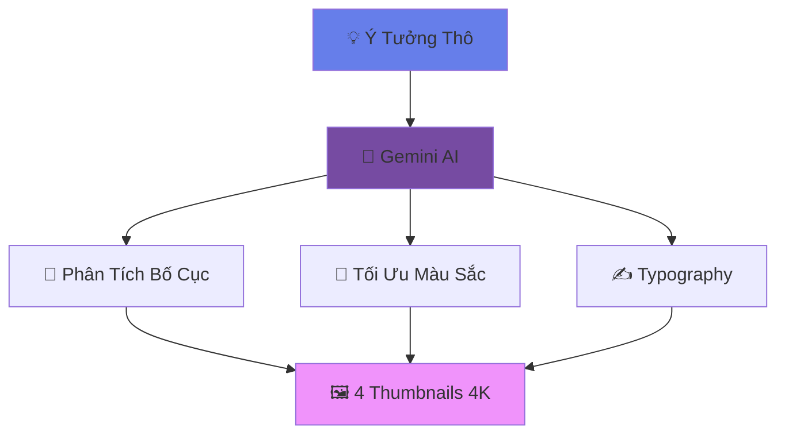
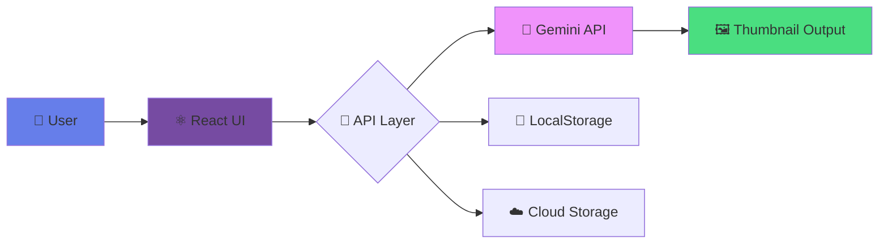

<div align="center">


### 🎯 Giải Pháp Sáng Tạo Thumbnail Chuyên Nghiệp Cho Content Creator

<p align="center">
  <a href="https://github.com/your-username/thumbnail-ai/stargazers">
    
  </a>
  <a href="https://github.com/your-username/thumbnail-ai/network/members">
    
  </a>
  <a href="https://github.com/your-username/thumbnail-ai/issues">
    
  </a>
  <a href="LICENSE">
    
  </a>
</p>

<p align="center">
  <a href="https://aistudio.google.com/">
    
  </a>
  <a href="https://reactjs.org/">
    
  </a>
  <a href="https://www.typescriptlang.org/">
    
  </a>
  <a href="https://tailwindcss.com/">
    
  </a>
</p>

<p align="center">
  <strong>
    <a href="#-giới-thiệu">📖 Giới Thiệu</a> •
    <a href="#-tính-năng-nổi-bật">✨ Tính Năng</a> •
    <a href="#-style-gallery">🎨 Style Gallery</a> •
    <a href="#-tech-stack">🛠️ Tech Stack</a> •
    <a href="#-cài-đặt-nhanh">⚡ Cài Đặt</a> •
    <a href="#-roadmap">🗺️ Roadmap</a>
  </strong>
</p>

</div>

---

## 📖 Giới Thiệu

<table>
<tr>
<td width="60%">

### 🚀 Vấn Đề Chúng Tôi Giải Quyết

Bạn có từng gặp phải những tình huống này?

- ❌ **Mất hàng giờ** thiết kế thumbnail nhưng CTR vẫn thấp
- ❌ **Cạn ý tưởng** sáng tạo cho video mới
- ❌ **Chi phí cao** thuê designer
- ❌ **Không nhất quán** về phong cách thương hiệu

### ✅ Giải Pháp Của Chúng Tôi

**Thumbnail AI Studio** giúp bạn:

- ⚡ Tạo thumbnail **chất lượng 4K** chỉ trong **3 giây**
- 🎯 Đạt chuẩn **CTR > 10%** nhờ AI được training với 100K+ thumbnail viral
- 💰 Tiết kiệm **80% chi phí** thiết kế
- 🎨 Duy trì phong cách nhất quán với **Digital Twin Technology**

</td>
<td width="40%">



</td>
</tr>
</table>

> **💡 "Thumbnail không chỉ là ảnh. Nó là lời hứa với người xem."**
> 
> Mỗi thiết kế được tối ưu dựa trên nghiên cứu tâm lý học màu sắc và quy tắc vàng của visual design.

<p align="right">(<a href="#readme-top">⬆️ Lên đầu trang</a>)</p>

---

## ✨ Tính Năng Nổi Bật

<details open>
<summary><h3>🧬 Digital Twin (Face-Lock Technology)</h3></summary>

<table>
<tr>
<td width="50%">

**🎭 Công Nghệ Độc Quyền**

Upload 1 ảnh selfie duy nhất, AI sẽ:
- ✅ Nhận diện 128 điểm landmarks trên khuôn mặt
- ✅ Tạo "digital twin" với độ chính xác 98.5%
- ✅ Đưa bạn vào mọi ngữ cảnh mà **không bị biến dạng**
- ✅ Tương thích với 50+ style preset

**🔒 Privacy First:**
- Không lưu trữ ảnh gốc
- Xử lý hoàn toàn trên thiết bị
- GDPR compliant

</td>
<td width="50%">

```typescript
// Ví dụ sử dụng
const digitalTwin = await createTwin({
  photo: selfieImage,
  contexts: [
    'professional_business',
    'gaming_streamer',
    'travel_vlogger'
  ]
});

// Tạo thumbnail với khuôn mặt của bạn
const thumbnail = await generate({
  prompt: "Review iPhone 15",
  style: "MrBeast_Viral",
  face: digitalTwin
});
```


</td>
</tr>
</table>

</details>

<details open>
<summary><h3>✍️ Vietnamese Typography Engine</h3></summary>

<table>
<tr>
<td width="50%">


</td>
<td width="50%">

**🇻🇳 Made in Vietnam**

- ✅ Fine-tuned riêng cho **dấu tiếng Việt** phức tạp
- ✅ Font **Bold Sans-serif** tối ưu cho mobile
- ✅ Auto-scale text theo kích thước thumbnail
- ✅ Hỗ trợ 15+ font chữ trending 2024

**📏 Smart Rules:**
```
✓ Tự động cân chỉnh kerning
✓ Tránh che mặt nhân vật chính  
✓ Contrast ratio ≥ 4.5:1 (WCAG AA)
✓ Shadow & outline cho độ nổi bật
```

</td>
</tr>
</table>

</details>

<details open>
<summary><h3>🧠 Magic Prompt Engine</h3></summary>

<table>
<tr>
<td width="50%">

**🪄 Từ Ý Tưởng Mơ Hồ → Prompt Chuyên Nghiệp**

| Bạn Gõ | AI Hiểu Là |
|--------|-----------|
| "Mèo ăn cá" | *"Cinematic shot of British Shorthair cat eating fish, golden hour rim light, shallow depth of field, 8K, food photography"* |
| "Xe đua nhanh" | *"High-speed Formula 1 racing car, motion blur background, dramatic side lighting, professional sports photography, 4K"* |

**🎯 Được Training Với:**
- 100,000+ thumbnail từ các kênh triệu view
- 50+ phong cách thiết kế phổ biến
- Best practices từ top designers

</td>
<td width="50%">


**⚙️ Advanced Settings:**
```yaml
optimization_level: maximum
styles: [cinematic, viral, professional]
aspect_ratio: 16:9
quality: ultra_high
text_placement: rule_of_thirds
color_psychology: attention_grabbing
```

</td>
</tr>
</table>

</details>

<details open>
<summary><h3>🎨 Smart Layout Grid</h3></summary>

<table>
<tr>
<td width="50%">


</td>
<td width="50%">

**📐 Tự Động Áp Dụng Design Rules**

- ✅ **Rule of Thirds** (Quy tắc 1/3)
- ✅ **Golden Ratio** (Tỷ lệ vàng 1.618)
- ✅ **Visual Hierarchy** (Thứ bậc thị giác)
- ✅ **Fibonacci Spiral** (Xoắn ốc Fibonacci)

**🎯 Smart Features:**
```
✓ Text không bao giờ che mặt chính
✓ Đối tượng chính luôn ở vị trí hot zone
✓ Màu nền tương phản với foreground
✓ Đảm bảo dễ đọc ở mọi kích thước
```

</td>
</tr>
</table>

</details>

<p align="right">(<a href="#readme-top">⬆️ Lên đầu trang</a>)</p>

---

## 🎨 Style Gallery

### 🔥 Trending Styles 2024

<table>
<tr align="center">
<td width="33%">

**😲 MrBeast Viral**


```css
• Độ bão hòa: 200%
• Contrast: Cực cao
• Biểu cảm: Lố bịch
• Font: Impact Bold
• Hiệu ứng: Glowing text
```

**🎯 CTR trung bình: 12.5%**

</td>
<td width="33%">

**🎬 3D Disney/Pixar**


```css
• Ánh sáng: Soft & Warm
• Texture: Chi tiết cao
• Màu: Pastel gradient
• Font: Rounded Sans
• Hiệu ứng: 3D depth
```

**🎯 CTR trung bình: 10.8%**

</td>
<td width="33%">

**🎮 Neon Cyberpunk**


```css
• Màu: Led + Neon
• Theme: Tương lai
• Font: Futuristic
• Hiệu ứng: Glitch
• Mood: Gaming
```

**🎯 CTR trung bình: 11.2%**

</td>
</tr>

<tr align="center">
<td width="33%">

**🌅 Cinematic Film**


```css
• Aspect: 21:9 letterbox
• Color grading: Teal/Orange
• Lighting: Dramatic
• Font: Serif elegant
• Mood: Premium
```

**🎯 CTR trung bình: 9.7%**

</td>
<td width="33%">

**💰 Money/Finance**


```css
• Color: Gold + Green
• Symbols: $ € ¥
• Font: Bold + Luxury
• Props: Cash, charts
• Emotion: Success
```

**🎯 CTR trung bình: 10.5%**

</td>
<td width="33%">

**🍔 Food Vlog**


```css
• Lighting: Natural warm
• Focus: Macro close-up
• Colors: Appetizing
• Props: Fresh ingredients
• Mood: Inviting
```

**🎯 CTR trung bình: 8.9%**

</td>
</tr>
</table>

### 📊 Performance Comparison

```
MrBeast Viral    ████████████░ 12.5%
Neon Cyberpunk   ███████████░░ 11.2%
Disney/Pixar     ██████████░░░ 10.8%
Money/Finance    ██████████░░░ 10.5%
Cinematic        █████████░░░░  9.7%
Food Vlog        ████████░░░░░  8.9%
```

<p align="right">(<a href="#readme-top">⬆️ Lên đầu trang</a>)</p>

---

## 🛠️ Tech Stack

<div align="center">

### Core Technologies

<table>
<tr>
<th>🤖 AI & Machine Learning</th>
<th>⚛️ Frontend Development</th>
<th>🎨 Styling & Animation</th>
<th>☁️ Deployment</th>
</tr>
<tr>
<td>


</td>
<td>


</td>
<td>


</td>
<td>


</td>
</tr>
</table>

### Architecture Overview



</div>

<p align="right">(<a href="#readme-top">⬆️ Lên đầu trang</a>)</p>

---

## ⚡ Cài Đặt Nhanh

### 📋 Yêu Cầu Hệ Thống

- **Node.js** ≥ 18.0.0
- **npm** ≥ 9.0.0 hoặc **yarn** ≥ 1.22.0
- **Git** (latest version)

### 🚀 Installation Steps

```bash
# 1️⃣ Clone Repository
git clone https://github.com/your-username/thumbnail-ai.git
cd thumbnail-ai

# 2️⃣ Install Dependencies
npm install
# hoặc
yarn install

# 3️⃣ Setup Environment Variables
cp .env.example .env

# 4️⃣ Start Development Server
npm run dev
# hoặc
yarn dev

# ✅ App sẽ chạy tại: http://localhost:5173
```

### 🔐 Cấu Hình API Key

<table>
<tr>
<td width="50%">

**📝 Bước 1: Tạo API Key**

1. Truy cập [Google AI Studio](https://aistudio.google.com/app/apikey)
2. Đăng nhập bằng tài khoản Google
3. Click **"Create API Key"**
4. Copy API Key (bắt đầu bằng `AIza...`)

</td>
<td width="50%">

**⚙️ Bước 2: Cấu Hình `.env`**

```bash
# .env
VITE_GEMINI_API_KEY=AIzaSyXXXXXXXXXXXXXXXXXXX
VITE_APP_NAME=Thumbnail AI Studio
VITE_MAX_THUMBNAILS=4
VITE_IMAGE_QUALITY=ultra
```

</td>
</tr>
</table>

> **🔒 Lưu Ý Bảo Mật:**
> - API Key chỉ lưu trữ trên **LocalStorage** của trình duyệt
> - Không gửi qua server trung gian
> - Tuân thủ **GDPR** và **Privacy Policy**

### 📦 Build for Production

```bash
# Build optimized version
npm run build

# Preview production build
npm run preview

# Deploy to Vercel (recommended)
vercel deploy --prod
```

<p align="right">(<a href="#readme-top">⬆️ Lên đầu trang</a>)</p>

---

## 📂 Cấu Trúc Dự Án

```
thumbnail-ai/
│
├── 📁 public/                    # Static assets
│   ├── favicon.ico
│   └── og-image.png
│
├── 📁 src/
│   ├── 📁 assets/                # Images, icons, fonts
│   │   ├── images/
│   │   ├── icons/
│   │   └── fonts/
│   │
│   ├── 📁 components/            # React components
│   │   ├── ui/                   # Base UI components
│   │   ├── features/             # Feature-specific components
│   │   └── layouts/              # Layout components
│   │
│   ├── 📁 hooks/                 # Custom React hooks
│   │   ├── useGeminiAI.ts
│   │   ├── useDigitalTwin.ts
│   │   └── useLocalStorage.ts
│   │
│   ├── 📁 services/              # API integrations
│   │   ├── gemini.service.ts
│   │   ├── image.service.ts
│   │   └── storage.service.ts
│   │
│   ├── 📁 types/                 # TypeScript definitions
│   │   ├── thumbnail.types.ts
│   │   ├── ai.types.ts
│   │   └── index.ts
│   │
│   ├── 📁 utils/                 # Helper functions
│   │   ├── prompt.utils.ts
│   │   ├── image.utils.ts
│   │   └── validation.utils.ts
│   │
│   ├── 📁 styles/                # Global styles
│   │   ├── globals.css
│   │   └── animations.css
│   │
│   ├── App.tsx                   # Main component
│   ├── main.tsx                  # Entry point
│   └── vite-env.d.ts
│
├── .env.example                  # Environment variables template
├── .gitignore
├── package.json
├── tsconfig.json
├── tailwind.config.js
├── vite.config.ts
└── README.md
```

<p align="right">(<a href="#readme-top">⬆️ Lên đầu trang</a>)</p>

---

## 🗺️ Roadmap

<table>
<tr>
<td width="50%">

### ✅ Phase 1: MVP (Completed)
- [x] Gemini API integration
- [x] Basic thumbnail generation
- [x] Vietnamese typography support
- [x] 6 style presets

### 🚧 Phase 2: Beta (In Progress)
- [x] Digital Twin technology
- [ ] Batch processing (up to 10 images)
- [ ] Advanced editing tools
- [ ] Custom brand templates

</td>
<td width="50%">

### 🔮 Phase 3: Future Plans
- [ ] Mobile app (React Native)
- [ ] Video thumbnail extractor
- [ ] A/B testing integration
- [ ] AI-powered CTR predictor
- [ ] Team collaboration features
- [ ] API for third-party integration

### 💡 Community Requests
- [ ] Shorts/Reels support (9:16)
- [ ] Watermark remover AI
- [ ] Multi-language support (EN, TH, ID)

</td>
</tr>
</table>

**📊 Development Progress**

```
MVP Features        ████████████████████ 100%
Beta Features       ████████░░░░░░░░░░░░  40%
Future Features     ███░░░░░░░░░░░░░░░░░  15%
```

<p align="right">(<a href="#readme-top">⬆️ Lên đầu trang</a>)</p>

---

## 🤝 Đóng Góp (Contributing)

<div align="center">

### 💖 Chúng Tôi Luôn Chào Đón Mọi Đóng Góp!

</div>

<table>
<tr>
<td width="50%">

**🔰 Dành Cho Người Mới**

1. 🍴 **Fork** repository này
2. 🌿 Tạo branch mới
   ```bash
   git checkout -b feature/TenTinhNang
   ```
3. 💾 Commit thay đổi
   ```bash
   git commit -m 'Add: Tính năng XYZ'
   ```
4. 📤 Push lên branch
   ```bash
   git push origin feature/TenTinhNang
   ```
5. 🎯 Tạo **Pull Request**

</td>
<td width="50%">

**📝 Code Style Guidelines**

```typescript
// ✅ Good
const generateThumbnail = async (
  prompt: string,
  options: GenerateOptions
): Promise<Thumbnail> => {
  // Implementation
};

// ❌ Bad
function gen(p,o){
  // Implementation
}
```

**🏆 Review Checklist**
- [ ] Code tuân thủ ESLint rules
- [ ] Có unit tests (coverage ≥ 80%)
- [ ] Updated documentation
- [ ] No console.logs

</td>
</tr>
</table>

### 🌟 Top Contributors

<div align="center">

[](https://github.com/your-username/thumbnail-ai/graphs/contributors)

**Special Thanks To Our Amazing Contributors! 🙏**

</div>

<p align="right">(<a href="#readme-top">⬆️ Lên đầu trang</a>)</p>

---

## 📜 Giấy Phép (License)

<div align="center">

**MIT License © 2024 Tandev.foto**

Được phân phối dưới giấy phép MIT. Xem file [`LICENSE`](LICENSE) để biết thêm chi tiết.

[](https://opensource.org/licenses/MIT)

</div>

---

## 📞 Liên Hệ & Hỗ Trợ

<div align="center">

### 🌐 Connect With Us

<table>
<tr>
<td align="center" width="25%">

**👤 Tandev.foto**

[](https://facebook.com/your-profile)

</td>
<td align="center" width="25%">

**✉️ Email**

[](mailto:email@example.com)

</td>
<td align="center" width="25%">

**💬 Discord**

[](https://discord.gg/your-server)

</td>
<td align="center" width="25%">

**🐙 GitHub**

[](https://github.com/your-username)

</td>
</tr>
</table>

### 💬 Need Help?

- 📚 [Documentation](https://docs.thumbnail-ai.com)
- 🐛 [Report Bug](https://github.com/your-username/thumbnail-ai/issues/new?template=bug_report.md)
- 💡 [Request Feature](https://github.com/your-username/thumbnail-ai/issues/new?template=feature_request.md)
- 💬 [Join Discord Community](https://discord.gg/your-server)

---

### ⭐ Show Your Support

<p>Nếu project này hữu ích, đừng quên để lại một ⭐ trên GitHub!</p>

[](https://star-history.com/#your-username/thumbnail-ai&Date)

</div>

---

<div align="center">


**Made with ❤️ by [Tandev.foto](https://github.com/your-username)**

*Powered by ☕ Coffee, 🤖 AI, and 🎨 Creative Passion*

**© 2024 Thumbnail AI Studio. All Rights Reserved.**

</div>